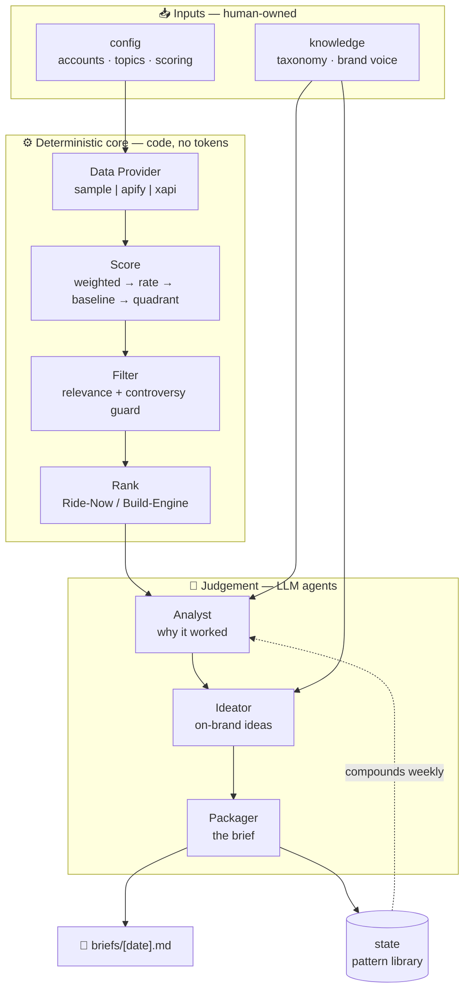
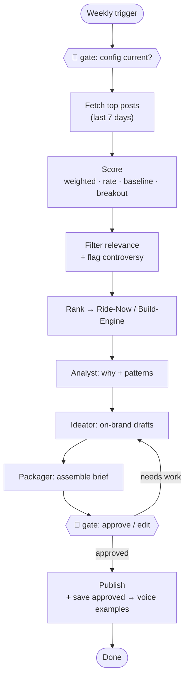
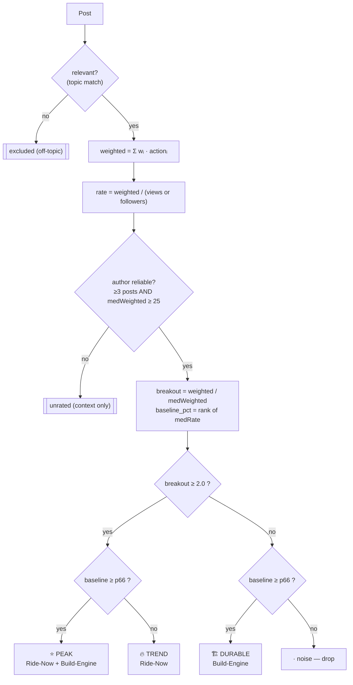

# CMO Agent — Weekly Content Intelligence

> An AI agent that, every week: **(1)** finds the best-performing content in your niche on
> X, **(2)** explains *why* it worked, **(3)** generates on-brand content ideas, and
> **(4)** packages an executable weekly brief a content writer can run cold.

Built in Claude Code. Originally a Founder's Office (Marketing & AI) take-home for **Bricx
Labs**, now an open-source content-intelligence engine.

---

## Table of contents
- [What it does](#what-it-does)
- [High-Level Design (HLD)](#high-level-design-hld)
- [Low-Level Design (LLD)](#low-level-design-lld)
- [Module reference](#module-reference)
- [Setup](#setup)
- [Run it](#run-it)
- [The web app](#the-web-app)
- [Hosting](#hosting)
- [Roadmap → SaaS](#roadmap--saas)
- [License](#license)
- [Shoutout](#-shoutout)

---

## What it does

```
RESEARCH ─► ANALYZE ─► IDEATE ─► PACKAGE
 top posts   why it     on-brand   an executable
 in niche    worked     ideas      weekly brief
```

Two design beats make it more than "sort by likes":
- **Engagement relative to each author's own baseline** — separates a one-off viral spike
  ("ride it this week") from a repeatable formula ("build it into the rotation").
- **Judgement, not an engagement sort** — a relevance filter drops off-topic virality, and a
  controversy guard flags posts whose reach came from a fight, not from value.

---

## High-Level Design (HLD)

> 📊 **Visual diagrams** (system context, container, flow, decision logic, sequence,
> deployment) with a principal-engineer's guide to drawing them:
> **[`docs/ARCHITECTURE.md`](docs/ARCHITECTURE.md)** — renders on GitHub.

The system is a **weekly batch pipeline** split into a deterministic half (cheap, fast,
testable, no tokens) and a judgement half (LLM). Volatility (data access) is isolated behind
one adapter; everything else is stable.



**Design principles**
1. **Contracts first** — fix the input (`Post`) and output (`Brief`) shapes; the middle is
   pure transformation.
2. **Isolate volatility** — the data source is the only fragile part, behind one `getPosts()`
   adapter. Config and logic never change when you swap sample → live.
3. **Code vs LLM split** — deterministic math (scoring/ranking) in code; judgement (why,
   ideation) in the LLM. Never ask the LLM to do arithmetic; never ask code to judge a hook.
4. **State = memory** — a pattern library compounds weekly, turning four reports into a
   learning loop.
5. **Human-in-the-loop** — the human owns config (before) and approves the brief (after). The
   agent drafts; it never posts.

**Surfaces**
- **CLI** (`scripts/run-analysis.js`) — runs the deterministic analysis.
- **Claude Code** (`.claude/commands/weekly-brief.md`) — orchestrates the full agent flow.
- **Static dashboard** (`web/`) — a zero-dependency presentation of the latest run.
- **Interactive app** (`web-app/`) — Next.js: paste JSON → analyze in-browser → generate brief.

**The weekly flow, with the two human gates:**



> Full diagram set (system context, sequence, web request flow, deployment) +
> a principal-engineer's guide to drawing them: **[`docs/ARCHITECTURE.md`](docs/ARCHITECTURE.md)**.

---

## Low-Level Design (LLD)

### The `Post` contract
The handshake between the volatile and stable halves. Every provider emits this shape:

```jsonc
{
  "id", "url", "created_at",                       // identity + timing
  "author":  { "handle", "name", "followers", "following", "verified", "tier" },
  "engagement": { "likes", "reposts", "replies", "quotes", "bookmarks", "views" },
  "content": { "text", "media_type", "media_count", "is_thread", "thread_len",
               "has_link", "post_type" }
}
```
Derived values (rate, day/hour, quadrant) are **computed**, never stored.

### Scoring (`src/core/score.js`)

**1 — Intent-weighted engagement** (weights in `config/scoring.yaml`; bookmarks/quotes top,
likes baseline, replies discounted for ambiguity):
```
weighted = likes·1 + reposts·3 + replies·3 + quotes·5 + bookmarks·5
```

**2 — Size-normalized rate** (kills "big account always wins"):
```
reach = views  (if present)  else  followers
rate  = weighted / reach
```

**3 — Author baseline** (per author, from their posts in the window):
```
medWeighted = median(weighted of author's posts)
medRate     = median(rate     of author's posts)
reliable    = (post_count >= 3)  AND  (medWeighted >= 25)   // else: unrated (guards tiny baselines)
```

**4 — Two axes**:
```
breakout      = weighted / medWeighted                       // self-relative spike (this post vs its own norm)
baseline_pct  = percentileRank(medRate, [reliable authors])  // cross-author consistency
```

**5 — Quadrant** (thresholds in config: `breakout_high = 2.0`, `baseline_high_pct = 66`):
| | baseline HIGH | baseline LOW |
|---|---|---|
| **breakout HIGH** | ⭐ `proven_peak` | 🔥 `trend` |
| **breakout LOW** | 🏗 `durable` | `noise` |

**The same logic as a decision flow (one post → one bucket):**



### Filter + guard (`src/core/filter.js`)
- **Relevance** — keyword match against a niche term list; no match ⇒ excluded (drops
  off-topic virality). *(The LLM Analyst does semantic relevance downstream; this is the cheap gate.)*
- **Controversy guard** — `replies ≥ 30` AND `replies/likes ≥ 2.0` ⇒ flag `⚠ verify`
  (reach from a ratio, not value).

### Ranking (`src/core/rank.js`)
```
ride_now = (trend + proven_peak)   sorted by breakout desc   // time-sensitive
engine   = (durable + proven_peak) sorted by rate desc       // evergreen
excluded = not relevant                                       // shown for transparency
unrated  = relevant but no reliable baseline
```

### The agents (LLM, `agents/*.md`)
| Agent | Reads | Produces |
|---|---|---|
| **Analyst** | `output/analysis.json` + `knowledge/pattern_taxonomy.md` | per-post *why*, named patterns, confidence, Pattern Watch |
| **Ideator** | Analyst output + `knowledge/brand_voice.md` | 5–7 on-brand ideas (draft + amplify), each traced to a pattern |
| **Packager** | both + `templates/brief_template.md` | the final `briefs/<date>.md` |

### Web app internals (`web-app/`)
- **Client**: `lib/engine/*` (ported, pure) runs `runAnalysis(posts, config)` in the browser.
- **Server**: `app/api/brief/route.js` — a serverless function holding `ANTHROPIC_API_KEY`,
  calls Claude with the system prompt in `lib/prompts.js` (taxonomy + voice + 3-stage
  instructions, prompt-cached).

### Tunable knobs (`config/scoring.yaml`)
`weights` · `breakout_high` · `baseline_high_pct` · `controversy_reply_ratio` ·
`controversy_min_replies` · `min_posts_for_baseline` · `min_baseline_weighted` · `reach.prefer`.

---

## Module reference

| Path | Responsibility |
|---|---|
| `config/accounts.yaml` | "Our industry" — tiered accounts (mirror + extensions) with per-account logic |
| `config/topics.yaml` | relevance topics + negative filters |
| `config/scoring.yaml` | engagement weights + thresholds (the knobs) |
| `data/sample_posts.json` | curated sample set (real + synthetic, labeled) |
| `src/providers/` | data adapters — `sample` \| `apify` \| `xapi` (same `getPosts()` contract) |
| `src/core/score.js` | weighted engagement, rate, baseline, breakout, quadrant |
| `src/core/filter.js` | relevance filter + controversy guard |
| `src/core/rank.js` | shortlists (Ride-Now / Build-Engine / excluded / unrated) |
| `src/pipeline.js` | orchestrates provider → score → filter → rank |
| `scripts/run-analysis.js` | CLI entry — report + `output/analysis.json` |
| `scripts/build-dashboard.js` | builds `web/data.js` for the static dashboard |
| `knowledge/pattern_taxonomy.md` | ~30 named patterns (the Analyst's lens) |
| `knowledge/brand_voice.md` | dual-register voice rules + examples (the Ideator's lens) |
| `agents/*.md` | Analyst / Ideator / Packager prompts |
| `.claude/commands/weekly-brief.md` | the orchestration slash command |
| `templates/brief_template.md` | the output contract |
| `web/` | static landing + dashboard (zero deps) |
| `web-app/` | interactive Next.js demo (paste → analyze → brief) |
| `docs/` | DECISIONS log · SAAS_ARCHITECTURE · LOOM_SCRIPT |

---

## Setup

**Prerequisites:** Node ≥ 18.

```bash
git clone https://github.com/milliondreamsblog/CMO_agent.git
cd CMO_agent
npm install
```

For live brief generation (web app), set an Anthropic key:
```bash
cd web-app && cp .env.example .env.local   # add ANTHROPIC_API_KEY=sk-ant-...
```

---

## Run it

```bash
npm run analyze       # deterministic weekly analysis → output/analysis.json
npm run web           # analyze + build the static dashboard (web/data.js)
```
Then open `web/index.html` (double-click — fully static).

**Full agent flow (in Claude Code):**
```
/weekly-brief         # runs analyze, then Analyst → Ideator → Packager → briefs/<date>.md
```

---

## The web app

A hostable, interactive demo: **paste a week of posts as JSON → Analyze (in-browser) →
Generate brief (LLM).**

```bash
cd web-app
npm install
npm run dev           # http://localhost:3000
```
- **Analyze** runs entirely client-side (no key needed).
- **Generate brief** calls Claude via the serverless route (needs `ANTHROPIC_API_KEY`).
- Click **Load sample data** to try it instantly.

---

## Hosting

- **Static dashboard** (`web/`) — any static host (GitHub Pages, Netlify, Cloudflare Pages).
- **Web app** (`web-app/`) — **Vercel**: New Project → Root Directory `web-app` → add
  `ANTHROPIC_API_KEY` → deploy. Serverless route runs the LLM; the page runs the engine.
- **Weekly automation** — GitHub Actions cron (Mon 06:00) → `npm run analyze` → agent step →
  open a PR with the brief for human review. Also works via Vercel Cron or the Claude Agent SDK.

---

## Roadmap → SaaS

See [`docs/SAAS_ARCHITECTURE.md`](docs/SAAS_ARCHITECTURE.md). Highlights: the engine ports
cleanly; the make-or-break is X-data access + cost (not the frontend); two surfaces
(Astro/Cloudflare marketing site for SEO + the app); smartest GTM is agency-mode first.

---

## License

[MIT](LICENSE) © 2026 Akshat Darshi ([@milliondreamsblog](https://github.com/milliondreamsblog)).
Free to use, modify, and sell. Just keep the copyright notice.

## 💛 Shoutout

This is MIT — you can use it commercially, no strings. But if this project helps you **make
money** (a product, a client service, a paid newsletter), a shoutout is genuinely appreciated:

> Built on [CMO Agent](https://github.com/milliondreamsblog/CMO_agent) by
> [@milliondreamsblog](https://github.com/milliondreamsblog).

Tag me, link back, or just drop a ⭐ on the repo. Not required by the license — just kind. 🙏

---

*Built with Claude Code. The agent drafts; a human approves before anything posts.*
