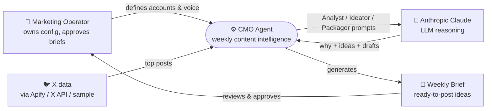
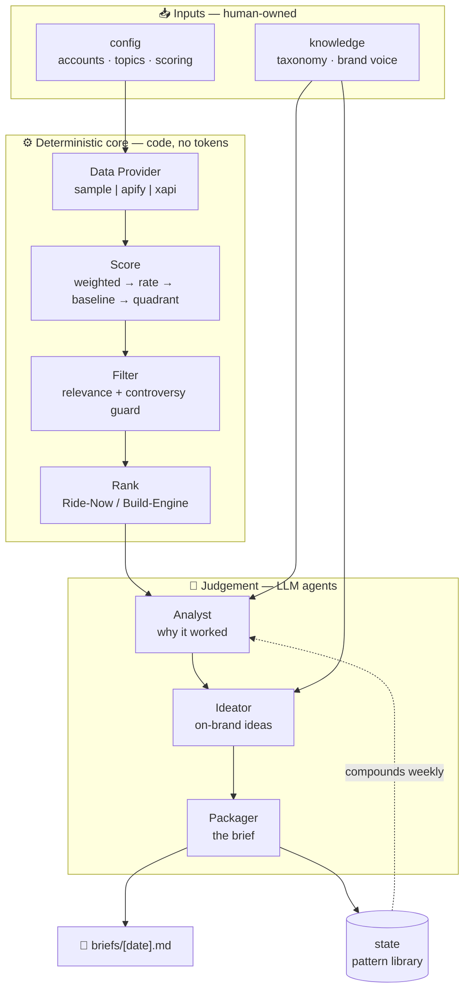
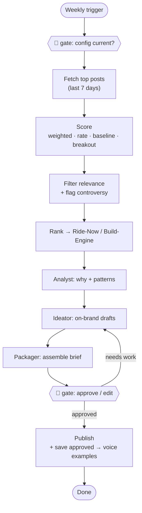
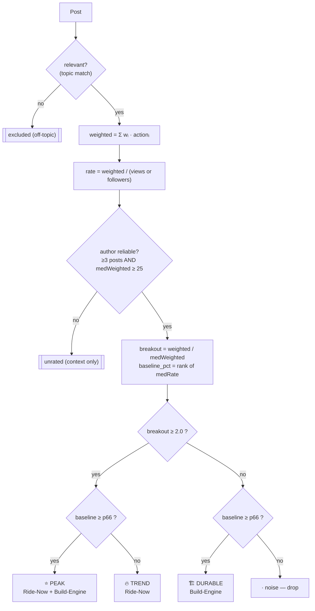
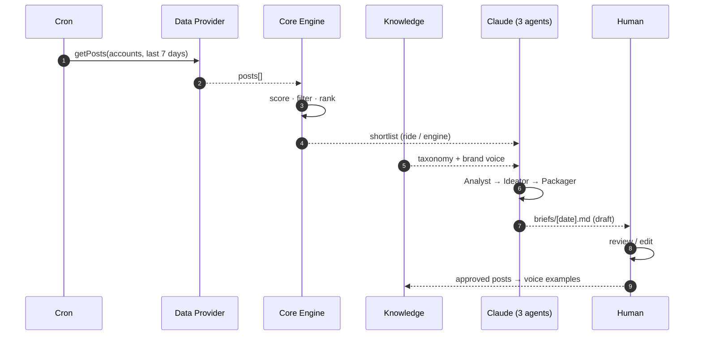
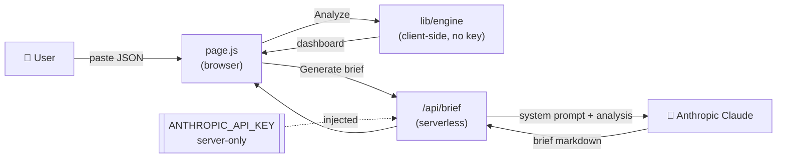
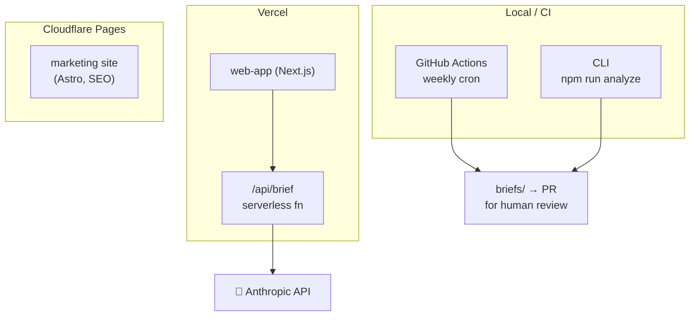

# Architecture — visual

Diagrams render natively on GitHub (Mermaid). They're **diagrams-as-code** — versioned and
diffable, never stale PNGs.

---

## How to build these — a principal engineer's guide to a senior designer

Before the diagrams, the rules they follow. If you're (re)drawing system architecture, this is
the rubric:

1. **Pick an altitude and stay there (C4 model).** Four levels — **Context** (who uses it +
   external systems), **Container** (the major deployable/runtime pieces), **Component** (modules
   inside a container), **Code** (rare; only the gnarly bits). *One diagram = one altitude.* The
   most common failure is mixing "user" and "a for-loop" in the same picture.

2. **One diagram answers one question.** State it in a sentence first. *"How does data flow each
   week?"* *"How is a post classified?"* If you can't name the question, the diagram is unfocused
   and will accrete boxes until it's wallpaper.

3. **Show boundaries, not just boxes.** The value is in the *lines you group*. Use subgraphs for
   **trust/runtime boundaries** — deterministic-vs-LLM, client-vs-server, our-code-vs-vendor.
   Boundaries are where the design decisions live.

4. **Direction encodes meaning.** Left→right for pipelines and time; top→down for decisions and
   hierarchy. Be consistent — readers infer flow from layout before they read a single label.

5. **Name nodes by responsibility, not technology.** "Data Provider", not "Apify". The diagram
   should survive a vendor swap. Put the tech in a sub-label or a deployment view.

6. **Give node types distinct shapes + a legend.** Process `[ ]`, decision `{ }`, datastore
   `[( )]`, external/human a different shape. The eye should parse type before reading text.

7. **Mark the human and the fragile seams explicitly.** Where a human approves, and where the
   system touches something it doesn't control (an API, a scraper) — those are the two places
   reviewers care about most. Make them impossible to miss.

8. **Progressive disclosure.** Start at Context. Drill down *only* where the complexity earns a
   second diagram. Don't draw the Component view of a box nobody asks about.

9. **Label the edges that aren't obvious.** An arrow's meaning ("emits posts[]", "approved →
   voice examples") is often more important than the box. Unlabeled arrows hide the contract.

The diagrams below are ordered by altitude: **Context → Container → Flow → Decision → Sequence →
Web → Deployment.**

---

## 1 · System Context  *(Q: who and what does the agent talk to?)*

## 2 · Container / HLD  *(Q: what are the major building blocks, and where's the deterministic-vs-LLM boundary?)*

## 3 · Weekly pipeline flow  *(Q: what happens each week, and where does a human gate it?)*

## 4 · Scoring decision logic  *(Q: how is a single post classified into a quadrant?)*

## 5 · Weekly run sequence  *(Q: in what order do the parts collaborate over time?)*

## 6 · Web app request flow  *(Q: what runs in the browser vs on the server, and where's the key?)*

## 7 · Deployment view  *(Q: where does each piece actually run?)*

---

### Why these seven, and not one big one
Each answers a single question at a single altitude (rule 1 + 2). A reader new to the system
goes **1 → 2** and understands the shape in 60 seconds; an implementer drops into **4** or **6**
for the part they're touching. That's progressive disclosure (rule 8) — the whole point of
having more than one diagram instead of one unreadable mural.
